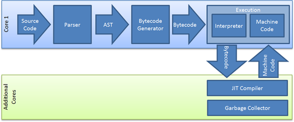

#Electron開発  
今回はElectronでHelper Appを実装します。  

## Electronとは  
Electronはデスクトップアプリを開発するためのフレームワークです。  
SlackのデスクトップアプリやMicrosoft Visual Studio CodeがElectronを使って作られています。  


### Electronの仕組み  
ElectronはchromiumブラウザとNode.jsを合体させたフレームワークです。  
GUIはWEB技術のHTML5で設計でき、他のプログラムはNode.jsで作ります。  


### ランタイム/実行環境とは  
ランタイムはソフトウエアを実行するために必要な部品のことです。実行環境とほぼ同義の意味です。  
JavaはJRE(Java実行環境)が必要です。FlashはFlash PlayerかFlash AIRが必要です。  
実行環境/ランタイムには複数の特徴があります。  

1. 複数の実装/種類のランタイムが存在する。
例:   
Java : Oracle JRE/Open JRE/IKVM.NET  
  
Python実行環境 : CPython/IronPython/PyPy/Jython  
Flash : Flash player/Flash AIR   
  
C# .NET : .NET Framework/mono  
  
JavaScriptエンジン : spidermonkey/v8/chakra/JavaScriptCore  
  
JavaScriptサーバーサイド実行環境 : Node.js/Jxcore/io.js  

2. ランタイムが必要なソフトウエアはクロスプラットフォームである場合が多い。  
Java : 30億のデバイスで走るJava(組み込み/Windows/Linux/Mac)  
C# : 組み込み, Windows, mac, Linux  
Python : Windows, mac, Linux  
ブラウザJavaScript : Windows, mac, Linux, IE, Chrome, Safari, Opera  

3. ランタイムが必要なソフトウエアはランタイムがないと動かない。  
Flash : Flash Playerがないと動かない  
Java :  JREがないと動かない  
C# : .NETがないと動かない  
JavaScript : ブラウザかNode.jsがないと動かない  

### Electronを使うとうれしいこと  
Scratchを使う初心者プログラマの環境構築したくない・GUI以外使いたくない、  
デベロッパーのアプリケーションを簡単にプログラミングしたい気持ちが、  
Elecronでマッチングできます。  
Electronを使用すると、Node.jsとchromiumブラウザが合体したアプリケーションを,  
Node.jsなどのランタイムなしで、アイコンのダブルクリックだけで起動することができます。  
Electronにはクロスコンパイルのような仕組みがあるため、  
mac, windows, linuxネイティブなアプリケーションをJavaScriptコードから生成できます。  
Javaはユーザーが動かすためにJREが必要ですが、  
Electronはユーザーは何もインストールする必要がありません。ダブルクリックだけです。  

## ElectronでHTTPサーバー、メインロジックをプログラミングする  
Node.jsでプログラミングします。  
### Node.jsとは  
Node.jsはサーバーサイドでJavaScriptを実行できるようにした実行環境です。
本来JavaScriptはWEBブラウザ上でしか動きませんでしたが、  
Node.jsを使うとJavaScriptでPythonやJavaと同じように汎用的なプログラムが作れます。  
コーディングされたJavaScriptがシングルスレッドで非同期に実行されることが特徴です。  
少ないコンピューター資源でサーバーが作れることで有名です。  
C++でコーディングされたJIT VMのGoogle V8 Engineを使用しているため、  
高速でJavaScriptを実行することができます。  
最近は組み込み機器とNode.jsを組み合わせてIoTにも使われています。  
主にWEBサーバー開発やWEBフロントエンド開発に使用されます。  

### Node.jsの仕組み  
Node.jsには3つの仕組みがあります。  
1. 簡単に軽量なサーバープログラムが作れる  
2. NPMパッケージマネージャーを使って豊富なライブラリをすぐに使用することができる  
3. npm scriptで開発工程が自動化・効率化できる  

### サンプル：Node.jsでHTTPサーバーを作る  
```javascript  
const http = require('http');
http.createServer(function (req, res) {
res.writeHead(200, {'Content-Type': 'text/plain'});
	res.end('Hello World\n');
}).listen(8080);
console.log('Server running at http://127.0.0.1:8080/');
```

## Electron UI開発  
HTML5でプログラミングします。  
Electronは同じコードで複数のプラットフォーム用にデスクトップアプリを配布できます。  
WEB UIの知識が必要です。  

### コンピューターのUIの種類

#### CUI  
CUIは文字列を入力として、文字列を出力として表示するUIです。  
GUIが一般的になる前は、一般人は嫌々ながらも使っていたそうです。  
キャラクターベースのため、出力は1行ずつになります。  
一般人が大嫌いなUIです。  

#### TUI  
TUIはターミナル上で1度に画面全体に色付きで出力できるインターフェースです。  
BIOSやMS-DOSゲーム(ロックマンなど)がTUIソフトウエアとして有名です。  

#### GUI  
GUIはCGとポインティングデバイスを使用して、直感的な操作を提供するUIです。  
CUI/TUIとは比較にならない可視化機能を持っています。  
タスクの可視化 : タスクウィンドウ  
コマンドの可視化 : メニュー、ボタン  
データの可視化 : アイコン  
一般人が頭で考えると難しいタスク、コマンド、データなどの概念を、  
直感的に使用できるようにしている非常に優れたUIです。  
GUIを実現するには、2つのソフトウエアが必要です。  
1. ウィンドウシステムと呼ばれる、タスクをウィンドウとして管理し、  
ポインティングデバイスの入力を処理するシステム  
2. デスクトップ環境と呼ばれる、  
アイコン、ウィンドウ、ツールバーなどのUI(見た目)を司るシステム  


### GUIプログラミングとプラットフォーム依存  
GUIプログラミングは非常にプラットフォームへの依存性が高いです。  
なぜなら、描画のAPIがOSに依存しているからです。  
WindowsはXAML/WPF, MacはCocoa, LinuxはGTK・Qt, AndroidはSurfaceなどの別々なフレームワークで実装する必要があります。  
そのため、通常はGUIアプリを複数のプラットフォームでローンチするためには、  
複数のGUIフレームワークを覚えてプログラミングする必要があります。  
非常に面倒です。  

### WEBアプリ, ネイティブアプリとハイブリッドアプリ  
スマホの到来によって、スマホアプリの開発が盛んになりました。  
そこで、アプリ開発の新しい手法が注目されるようになりました。  

#### WEBアプリ  
WEBページでネイティブアプリケーションのような複雑な動作やUIを実現しているソフトウエアです。  
HTML5の登場により、注目されるようになりました。  
WEB用のコードだけで、ブラウザがあるすべてのデバイスで動作します。  
bootstrapなどのフレームワークを使用すると、UIデザインもすべてのデバイスで共通化できます。  

#### ネイティブアプリ  
デバイスにインストールして使用するアプリです。  
プラットフォーム依存のアプリです。  
ネイティブアプリをiOSとAndroid両方にローンチしたい場合は、  
iOS版とAndroid版のアプリのコードを両方書かなければいけません。  

#### ハイブリッドアプリ  
WEBアプリとネイティブアプリ両方の特徴を持ったアプリです。  
デザインとHTTPサーバーの通信はWEBアプリで共通化し、  
ハードウエアやプラットフォーム特有の機能を使用したい部分はネイティブアプリのコードで作れます。  
アプリ開発のコストを軽減しながら、アプリの性能も追求することができます。  

### WEBとUIの歴史  
WEB UIはノウハウ、フレームワークやドキュメントがネイティブUIに比べて充実しています。  
もともとWEBは研究者が文書を共有するために生まれました。  
そのため、WEBが生まれた当初は文字しか表示できなかったのですが、  
時間が経つにつれて画像の表示や、動的なWEBサイトの作成ができるようになりました。  

#### 初期のWWW  
もともとWWWは研究者が文書を共有するために生まれました。  
そのインターネットで共有する文書のフォーマットがHTMLです。  
そのため、当初のHTMLは文字情報だけしか使用できませんでした。  

#### 初期のブラウザ  
最も初期のブラウザはHTTPではないネットワーク上にあるテキストファイルを  
観覧するためのCUIソフトウエアでした。  
1992年にWWW対応のブラウザが生まれました。  
WWW対応のViolaWWWやLynxブラウザ（現在もあります）はGUIではなく、  
TUIで作られていました。  

#### マルチメディアとGUIブラウザの台頭  
1992年にWindowsで動く世界初のGUI WEBブラウザCelloが発表されました。  
そして、1993年に文書の中に画像を表示できるブラウザMosaicが発表されたことで、  
WEBブラウザアプリケーションが爆発的に一般人に使用されるようになりました。  
今までのブラウザは画像のリンクをクリックすると、画像をダウンロードして、  
その画像を別のアプリケーションで見るという仕組みになっていました。  
その当時の他のブラウザは、  
ブラウザ上で表やチャートなどの論文に必要なものをを表示する方針でしたが、  
Mosaicは一般人にマルチメディアコンテンツを提供することに注目していました。  
1994年にMosaicチームのリーダーがNetscape社を設立、Navigatorを発表しました。  
1995年にブラウザのデファクトスタンダードになりました。  

####ブラウザ戦争と拡張HTML  
MicrosoftがSpyglass社からInternet Explorerを買収し、発表したことで勃発しました。  
ブラウザ同士の競争が盛んになり、ブラウザごとの独自HTML拡張の実装が盛んになりました。  
1996年にIEは世界で初めてブラウザにCSSを実装。  
Netscapeはブラウザにcookie, frame, JavaScriptを導入し,   
W3C(WWWの標準化団体)やECMAで標準化されたことによって,  
WEBアプリケーションの元となる技術の一つ「DHTML」が誕生しました。  

#### DHTMLとインタラクティブWEBページ  
  
DHTMLはブラウザ戦争、ブラウザの機能拡張競争によって生まれた技術です。  
HTMLだけでは静的なWEBページしか作成できません。  
http://abehiroshi.la.coocan.jp/  
DHTMLは、JavaScriptやCSSを使ってHTMLを動的に書き換えます。  
WEB上でアニメーションやゲーム、ボタンをクリックして遷移するアプリケーションを  
作ることを可能にしました。
http://vincentgarreau.com/particles.js/  

#### Ajaxとは  
  
Ajaxは2005年から注目された、ウェブブラウザ内でHTTPの非同期通信を行いながらUIの変更を行う技術です。  
Google Mapや初期のFacebookがAjaxを使ったWEBアプリケーションとして有名です。  
Ajaxを使用すると、ページの再読み込み無しでインターネットから  
新しいコンテンツをページが表示することができます。  
Google MapがもしAjaxを使用していなかったら、  
場所を移動するときにいちいちページを再読み込みする必要がありました。  
Ajaxを使うと再検索や繰り返してサーバーと通信するときにページを再読み込みする必要がありません。  

例  
1. google mapで場所を移動したときにページを再読み込み無しでマップを読みこむ  
2. google検索でリアルタイムで検索結果を表示する  
3. Facebookで下にスクロールすると自動で投稿を読み込む  
Ajaxによって、 WEBアプリケーションが爆発的に増えました。  
DHTML + AjaxによるインタラクティブWEBページを作るためのフレームワークでは、  
jQueryが有名です。  

#### レスポンシブデザインとは  
レスポンシブデザインは2011年に登場した、  
様々な種類のスマホ・PC・タブレットに対して、  
WEBページの見た目や操作方法が最適化されたサイトを作るWEBデザインの手法です。  
レスポンシブデザインフレームワークでは、bootstrapが有名です。  
SPAと組み合わせることで、デザインレベルで1つのWEBアプリケーションだけで  
様々なデバイスに対応することができます。  
Scratch4Dの次期バージョンはレスポンシブデザインに対応します。  

#### SPAとは  
  
SPAは1つのページだけで構成されるWEBアプリケーションです。  
デスクトップアプリケーションに「ページ」というものは存在しませんよね。  
SPAはデスクトップアプリケーションのような振る舞いを持ちます。  
Ajaxが生まれたため、SPAが実現できるようになりました。  
画面遷移はDHTMLで、サーバーとの通信はAjaxで行います。  
モバイルWEBアプリなどはSPAで実装します。  
SPAフレームワークはReact.jsが有名です。  
