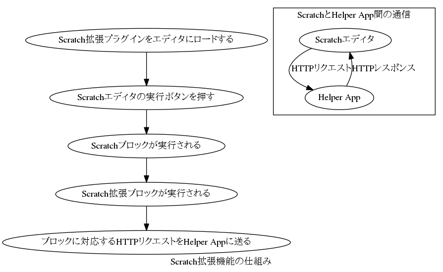

#Scratch4Dの仕組み  
Scratch4Dは「初心者プログラマでも簡単にドローンプログラミングができる」ことを目的として作られたソフトウエアです。  

##初心者プログラマでも簡単にドローンプログラミングができるための工夫  
1. Windowsでのサポートに最も力を入れました。  
初心者プログラマは多くの場合Windowsを使っています。  
2. アイコンのダブルクリックでソフトウエアを起動できるようにしました。  
初心者プログラマは、環境構築が嫌いです。  
3. 動画ビューやドローンの操作がGUIでできるようにしました。  
初心者プログラマは、CUIやコマンドラインが嫌いです。GUIが大好きです。  

## Scratch Extensions  
ScratchにはScratchXと呼ばれる、拡張機能があります。  
この拡張機能を使うことによって,  
ScratchでArduino, Kinect, Leap Motionなどのハードウエアと  
連携させることができるようになります。  

### Scratch拡張機能の仕組み  
以下のようなフローでScratch4Dは拡張機能を実現しています。  
  

### Scratch拡張機能を実現する方法  
拡張機能を実現するためには、2つのことを行う必要があります。  
1. Scratchの拡張プラグインをJSON形式で作成する。  
2. Scratch Helper Appと呼ばれるプログラムを作る。  

### 拡張プラグインを作る  
プラグインは拡張子が.s2eのJSON形式ファイルになります。  
プラグインの公式仕様書を読んで作ってください。  
https://wiki.scratch.mit.edu/w/images/ExtensionsDoc.HTTP-9-11.pdf  
サンプルとして、Arduino For Scratchのプラグインを貼ります。  
```json
{
"extensionName": "A4S (Arduino For Scratch)",
"extensionPort": 12345,
	"blockSpecs": [
		[" ", "set pin %n high", "pinHigh", 13],
		[" ", "set pin %n low", "pinLow", 13],
		[" ", "set pin %n as output", "pinOutput", 13],
		[" ", "set pin %n as input", "pinInput", 13],
		[" ", "set pin %n as %m.mode", "pinMode", 2, "Digital Input"],
		[" ", "digital write pin %n %m.highLow", "digitalWrite", 13, "high"],
		[" ", "analog write pin %n value %n", "analogWrite", 3, 255],
		[" ", "servo write pin %n degrees %n", "servoWrite", 5, 180],
		["b", "digital read pin %n", "digitalRead", 2],
		["r", "analog read pin %n", "analogRead", 0],
	],
	"menus": {
		"mode": ["Digital Input", "Digital Output","Analog Input","Analog Output(PWM)","Servo"],
		"highLow": ["high", "low"],
	},
}
```
### Scratch Helper Appを作る  
Scratch Helper Appは、Scratchとハードウエアのインターフェースの役目をします。  
Scratch Editorから送信されたHTTPリクエストを元に、ハードウエアを操作します。  
Scratch Helper Appは、HTTPリクエストを処理し、HTTPレスポンスを返すことができれば、  
どのようなプログラミング言語でも実装可能です。  
Javaで書かれていることが多いです。  
（多分HTTPやGUIの実装がしやすく、プログラミングしやすいため）  


